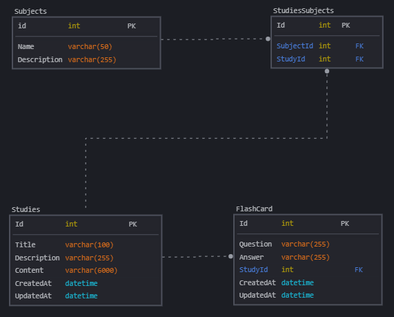

# My Studies
Projeto básico para registrar estudos avulsos e conseguir manipulá-los.

---

## Propósito

O propósito deste projeto é aprender e explorar um pouco das Minimal APIs do .NET.

## Rotas disponíveis

#### `Subjects`

- `GET /subjects`: Recupera todos os assuntos.
- `GET /subjects/{id}`: Recupera um assunto específico de acordo com o seu `Id`.
- `POST /subject`: Insere um novo assunto.
- `PUT /subjects/{id}`: Atualiza um assunto específico de acordo com o seu `Id`.
- `DELETE /subjects/{id}`: Remove um assunto específico de acordo com o seu `Id`.

## Construção do projeto

Esta seção serve como consulta para entender quais comandos foram executados para construir o projeto.


1 - Criação do projeto:
   
`dotnet new web -o MyStudies`

2 - Instalação do Entity Framework e ferramentas auxiliares

```
dotnet add package Microsoft.EntityFrameworkCore --version 7.0.0
dotnet add package Microsoft.EntityFrameworkCore.Tools --version 7.0.0
dotnet add package Microsoft.EntityFrameworkCore.Sqlite --version 7.0.0
```

3 -  Após a configuração executei um build

`dotnet build`

4 - Executar a primeira `migration` do EntityFramework

`dotnet ef migrations add InitialCreate`

OBS.: Tive que instalar a ferramenta de execução do entity antes de executar o comando, utilizei o comando abaixo para instalar:

`dotnet tool install --global dotnet-ef`

5 - Criando o banco de dados

`dotnet ef database update`

6 - Instalando o Swagger no projeto

`dotnet add package Swashbuckle.AspNetCore --version 7.0.0`

7 - Adicionando novas *migrations*

`dotnet ef migrations add IncludeStudyEntity`

8 - Removendo novas *migrations*

`dotnet ef migrations remove`

## Execução do projeto

Esta seção serve como consulta para entender quais passos são necessários para executar o projeto.


Comando para executar o projeto:

`dotnet run`


## Banco de dados

As tabelas do banco de dados são:

#### `Subjects` (Id, Name, Descrption);
  - Descrição: Esta tabela armazenará os diversos assuntos que podem ser associados a um estudo.
  - Exemplo de INSERT: `INSERT INTO Subjects (Name, Description) VALUES ("","");`

####  `Studies` (Id, Title, Descrption, Content, CreatedAt, UpdatedAt);
   - Descrição: Esta tabela armazenará os textos de cada estudo realizado, e vai poder ser associada ao assunto através da tabela `StudiesSubjects`.
   - Exemplo de INSERT: `INSERT INTO Studies (Title, Descrption, Content, CreatedAt, UpdatedAt) VALUES ("","","",date('now'),date('now'));`

#### `StudiesSubjects` (Id, SubjectId, StudyId);
  - Descrição: Esta tabela irá armazenar o relacionamento entre diversos assuntos e diversos estudos.
  - Exemplo de INSERT: `INSERT INTO Subjects (SubjectId, StudyId) VALUES (1,1);`
#### `FlashCard` (Id, Question, Answer, StudyId, reatedAt, UpdatedAt);
  - Descrição: Esta tabela irá armazenar os flash cards utilizados para revisão de um estudo.
  - Exemplo de INSERT: `IINSERT INTO FlashCard (Question, Answer, StudyId, CreatedAt, UpdatedAt) VALUES ("","",1,date('now'),date('now'));`

### Diagrama de entidades e relacionamentos

Neste diagrama podemos ver todas as tabelas que compõem o sistema e como estão relacionadas entre si.



OBS.: Diagrama desenvolvido utilizando o SqlDBM: https://sqldbm.com/